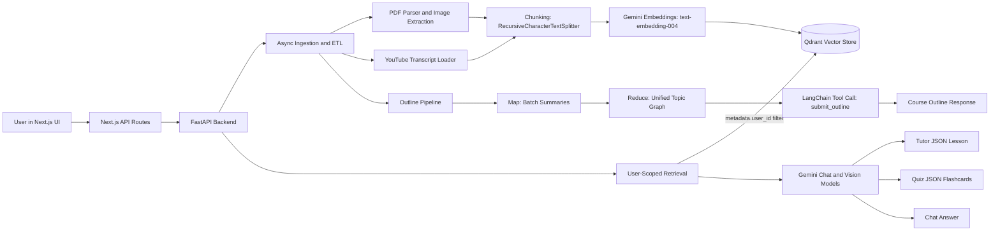

# Study Labs

Study Labs is a comprehensive personalized learning platform that leverages Artificial Intelligence to create adaptive learning experiences. It combines a modern, pastel-themed frontend with a powerful backend capable of processing documents and generating tailored course content, quizzes, and tutoring sessions.

## Why This Is Technically Interesting

This is not a thin chat wrapper around an LLM. The app implements a multi-stage retrieval-augmented learning system with user-isolated vector search, async ingestion, and tool-driven outline synthesis.

- **RAG Pipeline**: Uploaded PDFs and YouTube transcripts are parsed, chunked, embedded, and indexed, then retrieved at query-time to ground tutor/chat/quiz generation.
- **Qdrant Vector Search**: Context retrieval uses similarity search with metadata filters (`metadata.user_id`) so each user only queries their own knowledge base.
- **Async ETL + Ingestion**: File extraction and YouTube transcript processing run concurrently with `asyncio` + worker threads for higher throughput.
- **LangChain + Gemini Stack**: LangChain loaders/splitters/vector store orchestration sit on top of Gemini embedding and chat models.
- **Tool-Calling Agent for Outlines**: Outline generation uses a map-reduce style summarization workflow and a LangChain agent tool (`submit_outline`) to produce structured course topology.

  ## 🎥 Demo

https://github.com/user-attachments/assets/90e2c84e-5410-4abb-8f32-ef9353d1531f


## 🚀 Features

- ** Learning Paths**: AI-generated course outlines and lessons based on user inputs and uploaded documents.
- **Interactive AI Tutor**: A chatbot interface for real-time tutoring and doubt resolution.
- **Dynamic Quizzes**: Automatically generated quizzes to test knowledge and reinforce learning.
- **Document Integration**: Upload PDFs and provide YouTube URLs to generate context-aware learning materials.
- **Progress Tracking**: Visual indicators for course completion and lesson progress.
- **Clean & Modern UI**: A user-friendly interface built with Next.js and Tailwind CSS, featuring a soothing pastel color palette.
- **Math Support**: Rendering of mathematical equations using KaTeX.

## How It Works (Technical Flow)

1. **Ingestion API**
    `POST /upload_pdfs` accepts PDFs, optional YouTube URLs, and a required `user_id`.

2. **Async ETL**
    - PDFs are parsed page-by-page (text + embedded images via PyMuPDF).
    - YouTube transcripts are loaded via LangChain's `YoutubeLoader`.
    - Content is split with `RecursiveCharacterTextSplitter` (`chunk_size=2000`, overlap `200`).
    - Processing runs concurrently using `asyncio.gather(...)` and `asyncio.to_thread(...)`.

3. **Embedding + Indexing**
    - Chunks are embedded with `GoogleGenerativeAIEmbeddings` (`text-embedding-004`).
    - Vectors are stored in Qdrant through `QdrantVectorStore`.
    - Each chunk gets `metadata.user_id` for strict user-level context isolation.

4. **Retrieval-Augmented Generation**
    - Tutor/chat/quiz endpoints call user-scoped retrieval (`search_for_user`) with a Qdrant metadata filter.
    - Retrieved chunks are injected into prompts to ground responses.
    - Tutor can route to a vision-capable model when retrieved chunks include embedded image data.

5. **Outline Synthesis (Map-Reduce + Tool Calling)**
    - Large corpora are summarized in batches to avoid context overflow.
    - Summaries are reduced into a unified outline by a LangChain agent.
    - The final structure is emitted through a typed tool call (`submit_outline`) for predictable output shape.

## Architecture Diagram



## 🛠️ Tech Stack

### Frontend
- **Framework**: [Next.js 13+](https://nextjs.org/) (App Router)
- **Language**: TypeScript
- **Styling**: Tailwind CSS
- **UI Components**: Radix UI, Lucide React
- **Animations**: Framer Motion
- **Math Rendering**: KaTeX

### Backend
- **Framework**: [FastAPI](https://fastapi.tiangolo.com/)
- **Language**: Python
- **AI/LLM**: Gemini (`gemini-2.5-flash-lite`) via LangChain
- **Embeddings**: Gemini `text-embedding-004`
- **Vector Store**: Qdrant Cloud (`langchain_qdrant` integration)
- **Orchestration**: LangChain loaders, splitters, vector store, agent tool-calling
- **Async Data Pipeline**: `asyncio` + threaded loaders for concurrent file and YouTube processing

## 📂 Project Structure

```
Study-Labs/
├── backend/                 # FastAPI Backend
│   ├── app.py              # Main application entry point
│   ├── llm_services/       # AI/LLM logic (bot, outline generation)
│   ├── loaders/            # Document loaders (PDF, etc.)
│   ├── tools/              # Utility tools (embeddings, models)
│   ├── qdrant_data/        # Vector store data
│   └── requirements.txt    # Python dependencies
│
└── frontend/                # Next.js Frontend
    ├── app/                # App Router pages and layouts
    ├── components/         # Reusable UI components
    ├── lib/                # Utility functions and API clients
    └── package.json        # Node.js dependencies
```

## ⚡ Getting Started

### Prerequisites

- **Node.js** (v18+ recommended)
- **Python** (v3.10+ recommended)
- **Git**

### 1. Clone the Repository

```bash
git clone https://github.com/Olaiwonismail/Study-Labs.git
cd Study-Labs
```

### 2. Backend Setup

Navigate to the backend directory:

```bash
cd backend
```

Create a virtual environment (optional but recommended):

```bash
python -m venv venv
# On Windows
venv\Scripts\activate
# On macOS/Linux
source venv/bin/activate
```

Install dependencies:

```bash
pip install -r requirements.txt
```

Set up environment variables:
Create a `.env` file in the `backend` directory and add your API keys:

```env
GOOGLE_API_KEY=your_google_api_key_here
```

Run the server:

```bash
uvicorn app:app --reload
```
The backend API will be available at `http://localhost:8000`.

### 3. Frontend Setup

Open a new terminal and navigate to the frontend directory:

```bash
cd frontend
```

Install dependencies:

```bash
npm install
# or
yarn install
# or
pnpm install
```

Run the development server:

```bash
npm run dev
```
The frontend application will be available at `http://localhost:3000`.

## 📖 Usage

1.  **Sign Up/Login**: Create an account to track your progress.
2.  **Create a Course**: Upload relevant PDF documents or provide YouTube links to generate a new course.
3.  **Learn**: Navigate through the generated lessons.
4.  **Quiz**: Take quizzes to test your understanding.
5.  **Chat**: Use the AI tutor for specific questions related to the course material.

## 🤝 Contributing

Contributions are welcome! Please feel free to submit a Pull Request.

1.  Fork the project
2.  Create your feature branch (`git checkout -b feature/AmazingFeature`)
3.  Commit your changes (`git commit -m 'Add some AmazingFeature'`)
4.  Push to the branch (`git push origin feature/AmazingFeature`)
5.  Open a Pull Request

## 📄 License

[MIT](LICENSE)
